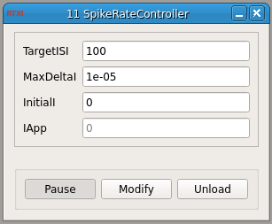

###Spike Rate Controller

**Requirements:** None  
**Limitations:** None  

<!--start-->
This module is designed to stabilize spike rates around a user-specified ISI. It reads in the spike state of a connected spike detector module and, depending on the state of the detector and the specified ISI, outputs a current. The amplitude is determined by comparing the error between real ISI and the target. When error oscillates around the target, output is small, but when error increases, the output increases in amplitude. 
<!--end-->

####Input Channels
1. input(0) - State : the 'state' of the detector

####Output Channels
1. output(0) - Iapp : the current (A)
2. output(1) - ISI : the inter-spike interval

####Parameters
1. TargetISI : the ideal ISI (ms)
2. MaxDeltaI : maximum rate of change for current (dA/dt)
3. InitialI : current (A) 

####States
1. IApp : current (A)

